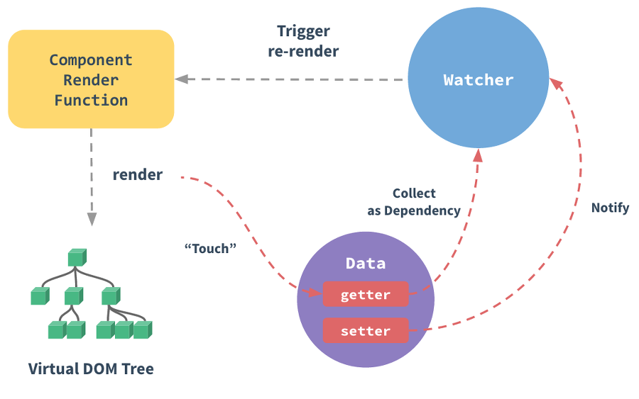
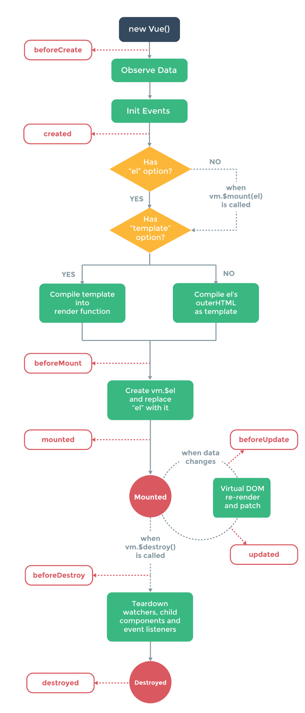

# Hello, Vue.js

### Vue.js 스타일가이드
https://kr.vuejs.org/v2/style-guide/#%EA%B7%9C%EC%B9%99-%EB%B6%84%EB%A5%98

### Vue.js API 문서
https://kr.vuejs.org/v2/api/


## Vue.js란
웹 UI 즉, View 개발에 초점을 맞춘 프로그레시브 프레임워크  

template 기반과 React.js의 Render Function을 모두 사용 가능.  
러닝커브가 낮은 문법과 프로젝트 설정.  
virtual DOM을 이용한 빠른 렌더링 및 저용량.  

Vue.js는 순수 자바스크립트에 가까운 React.js와는 다르게 고전적인 웹 개발 패러다임과 유사.  
HTMl을 이용한 템플릿 기반으로 View를 구성.  
Vue 컴포넌트 템플릿을 작성하는 방법은 여러가지.  

### 컴포넌트 템플릿을 작성하는 방법 (참고 사이트)
https://github.com/FEDevelopers/tech.description/wiki/Vue%EC%97%90%EC%84%9C-%EC%BB%B4%ED%8F%AC%EB%84%8C%ED%8A%B8-%ED%85%9C%ED%94%8C%EB%A6%BF%EC%9D%84-%EC%A0%95%EC%9D%98%ED%95%98%EB%8A%94-7%EA%B0%80%EC%A7%80-%EB%B0%A9%EB%B2%95

현재 개발된 PPP와 PTV 모두 유사 템플릿을 이용해 View를 구성하고 있기 때문에   
점진적으로 프로젝트에 적용하면 긍정적인 효과를 기대할 수 있습니다.  
Vue.js는 프레임워크이지만 CDN을 제공하여 가볍게 프로젝트에 Vue.js를 적용시킬 수 있습니다.  

```
<script src="https://cdn.jsdelivr.net/npm/vue/dist/vue.js"></script>
```

위 스크립트 한 줄이면 Vue.js는 별도의 변환 과정없이 적용됩니다.  
Vue 프레임워크 프로젝트 구축을 위한 CLI 또한 제공되고 있습니다.  

## Vue.js 핵심

### DOM 제어
지금까지 프로젝트에 쓰인 javascript 및 jQuery는 직접 DOM에 접근하여 조작했습니다.  
이러한 방식은 DOM에 접근하여 조작할 때마다 모든 DOM 트리를 순회하고 렌더링하기 때문에 속도가 저하되고,  
사이드이펙트가 발생할 확률이 높아졌습니다.  

Vue는 DOM 접근 및 조작을 Vue 코어 라이브러리에서 모두 처리해주고  
개발자는 DOM에 연결된 데이터만을 조작하면 되기 때문에 데이터 기반의 개발이 가능해졌습니다.  

```
document.getElementById('a').textContent = 'tlab'
```

자바스크립트에서는 text를 바꾸기 위해서 위처럼 DOM에 직접 접근하여 조작해야 했지만  

```
a.text = 'tlab'
```

위처럼 단순히 데이터를 변경만 해주면 Vue가 데이터 변경을 감지하고 화면을 재렌더링합니다.  
Vue는 매우 직관적이며 단순합니다.  

### Vue.js 반응형 동작원리


### React와 Angualr의 장점
Angualr에게는 없는 virtual DOM과 React에게 없는 양방향 바인딩을 제공합니다.  
Vue는 전체 DOM 트리를 순회하지 않고 DOM 변경사항을 virtual DOM과 비교한 후, 바뀐 부분만 실제 DOM에 반영합니다.  
또한 React에서는 따로 함수를 만들어 사용해야 하는 양방향 바인딩을 v-model이라는 디렉티브로 간단하게 제공합니다.  

### 컴포넌트 단위의 개발


## Vue.js / React.js
현재 자바스크립트의 대표적인 프레임워크로는 Vue.js와 React.js가 있습니다.  
짧은 코드를 통해 두 프레임워크가 대략 어떻게 동작하는지 비교해보겠습니다.  

### React.js
```
class Counter extends React.Component {
  constructor(props) {
    super(props);
    this.state = {
      number: 0
    };
  };
  handleClick() {
    this.setState(() => {
      return {number: this.state.number + 1};
    });
  };
  render() {
    return (
      <div>
        <h2>{this.state.number}</h2>
        <button onClick={this.handleClick}>Increase</button>
      </div>
    );
  };
```

위의 코드는 버튼을 누를 때마다 number가 1씩 증가하는 단순한 코드입니다.  
React는 state라는 불변의 속성을 가집니다.  
React는 state의 변경을 자동으로 감지하지 못하기 때문에 setState()을 사용하여 현재와 이전 상태를 비교하고   
DOM을 어떻게 다시 렌더링할지 결정합니다.  

### Vue.js
```
  <body>
    <div id='app'>
        <h5>Counter : {{number}}</h5>
        <button @click='test += 1'>Increase</button>
    </div>
    
<script>
    
    var data = {number: 0};

    var app = new Vue ({
        el: '#app',
        data: data
    });
```

반면 Vue는 HTML태그에 디렉티브를 이용하여 별도의 명령없이 데이터가 변경되면 반응적으로 렌더링됩니다.  
Vue 또한 별도의 작업을 통해 데이터를 불변상태로 유지하는 것이 가능합니다.  

<u>기본적으로 Vue는 데이터 객체를 생성한 후에 data를 자유롭게 업데이트가 가능하고,  
React는 state 객체를 생성한 후에 업데이트를 하려면 좀 더 작업을 해야합니다.</u>

### Vue.js 라이프 사이클
Vue는 직관적인 라이프 사이클을 가지고 있습니다.  
그리고 React와 마찬가지로 라이프 사이클 훅을 가지고 있어, 상태 관리 주기에 맞춰 개발이 가능합니다.  

#### Creation: 컴포넌트 초기화 단계
-BeforeCreate: 가장 먼저 실행이 됨. 인스턴스의 data, event 객체는 접근할 수 없음.  
-Create: data, event 객체가 준비 완료된 상태이므로 처리가 가능하다.  

#### Mounting: DOM 작성 단계
-BeforeMount: 템플릿 및 코드들이 렌더링 되기 직전에 호출됨. 거의 사용하지 않음.  
-Mounted: 컴포넌트, 템플릿, DOM이 모두 준비된 상태. 이 상태에서 ajax 처리 가능.  

#### Updating: 상태 변화로 인한 렌더링 단계
-BeforeUpdate: 컴포넌트 상태 변화가 일어나면 다시 DOM이 렌더링 되는데 그 전에 호출.  
-Updated: 상태 변화 후 렌더링이 완료되면 실행. 여기서 상태 값이 변경되면 무한루프에 빠짐.  

#### Destruction: 소멸 단계
-BeforeDestroy: 인스턴스 제거 직전에 호출.  
-Destroyed: 인스턴스 제거 완료 후 호출. 연관된 이벤트 리스너, 디렉디브 등이 해제.  



