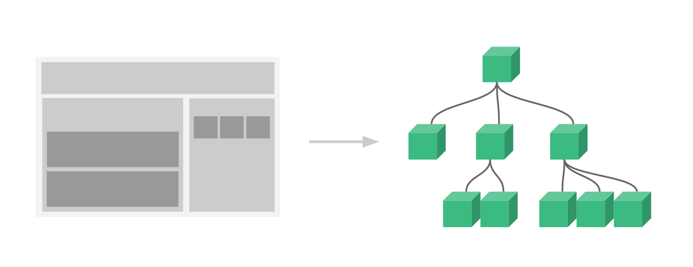

# Hello, Vue.js

## Vue.js란
웹 UI 즉, View 개발에 초점을 맞춘 프로그레시브 프레임워크  

template 기반과 React.js의 Render Function을 모두 사용 가능.  
러닝커브가 낮은 문법과 프로젝트 설정.  
virtual DOM을 이용한 빠른 렌더링 및 저용량.  

Vue.js는 순수 자바스크립트에 가까운 React.js와는 다르게 고전적인 웹 개발 패러다임과 유사.  
HTMl을 이용한 템플릿 기반으로 View를 구성.  
Vue 컴포넌트 템플릿을 작성하는 방법은 여러가지.  

### 컴포넌트 템플릿을 작성하는 방법 (참고 사이트)
https://github.com/FEDevelopers/tech.description/wiki/Vue%EC%97%90%EC%84%9C-%EC%BB%B4%ED%8F%AC%EB%84%8C%ED%8A%B8-%ED%85%9C%ED%94%8C%EB%A6%BF%EC%9D%84-%EC%A0%95%EC%9D%98%ED%95%98%EB%8A%94-7%EA%B0%80%EC%A7%80-%EB%B0%A9%EB%B2%95

현재 개발된 PPP와 PTV 모두 유사 템플릿을 이용해 View를 구성하고 있기 때문에   
점진적으로 프로젝트에 적용하면 긍정적인 효과를 기대할 수 있습니다.  
Vue.js는 프레임워크이지만 CDN을 제공하여 가볍게 프로젝트에 Vue.js를 적용시킬 수 있습니다.  

```
<script src="https://cdn.jsdelivr.net/npm/vue/dist/vue.js"></script>
```

위 스크립트 한 줄이면 Vue.js는 별도의 변환 과정없이 적용됩니다.  
Vue 프레임워크 프로젝트 구축을 위한 CLI 또한 제공되고 있습니다.  

## Vue.js 핵심

### DOM 제어
지금까지 프로젝트에 쓰인 javascript 및 jQuery는 직접 DOM에 접근하여 조작했습니다.  
이러한 방식은 DOM에 전역으로 접근하여 조작할 때마다 모든 DOM 트리를 순회하고 렌더링하기 때문에 속도가 저하되고,  
사이드이펙트가 발생할 확률이 높아졌습니다.  

Vue는 DOM 접근 및 조작을 Vue 코어 라이브러리에서 모두 처리해주고  
개발자는 DOM에 연결된 데이터만을 조작하면 되기 때문에 데이터 기반의 개발이 가능해졌습니다.  

```
document.getElementById('a').textContent = 'tlab'
```

자바스크립트에서는 text를 바꾸기 위해서 위처럼 DOM에 직접 접근하여 조작해야 했지만  

```
a.text = 'tlab'
```

위처럼 단순히 데이터를 변경만 해주면 Vue가 데이터 변경을 감지하고 화면을 재렌더링합니다.  
Vue는 매우 직관적이며 단순합니다.  

### Vue.js 반응형 동작원리


### React와 Angualr의 장점
Angualr에게는 없는 virtual DOM과 React에게 없는 양방향 바인딩을 제공합니다.  
Vue는 전체 DOM 트리를 순회하지 않고 DOM 변경사항을 virtual DOM과 비교한 후, 바뀐 부분만 실제 DOM에 반영합니다.  
또한 React에서는 따로 함수를 만들어 사용해야 하는 양방향 바인딩을 v-model이라는 디렉티브로 간단하게 제공합니다.  

### 컴포넌트 단위의 개발
컴포넌트 단위의 개발로 화면단을 구조화하여 일괄적인 패턴으로 개발을 할 수 있습니다.  
한마디로 컴포넌트 단위의 개발은 재사용 가능한 프로그램 구축하는 것과 같습니다.  
컴포넌트는 미리 정의된 옵션을 가지고 있는 Vue.js의 인스턴스와 같고, 인스턴스는 DOM에 연결됩니다.  
컴포넌트는 인스턴스가 어디에 연결되어 있든 모듈로 사용 가능합니다.  

Vue는 컴포넌트의 효율적인 재사용 및 설계를 위해 mixin이라는 기능을 제공합니다.  
공통적으로 쓰이는 기능을 다중상속하는 개념입니다.

#### mixin 예제
https://css-tricks.com/using-mixins-vue-js/



## Vue.js / React.js
현재 자바스크립트의 대표적인 프레임워크로는 Vue.js와 React.js가 있습니다.  
짧은 코드를 통해 두 프레임워크가 대략 어떻게 동작하는지 비교해보겠습니다.  

### React.js
```
class Counter extends React.Component {
  constructor(props) {
    super(props);
    this.state = {
      number: 0
    };
  };
  handleClick() {
    this.setState(() => {
      return {number: this.state.number + 1};
    });
  };
  render() {
    return (
      <div>
        <h2>{this.state.number}</h2>
        <button onClick={this.handleClick}>Increase</button>
      </div>
    );
  };
```

위의 코드는 버튼을 누를 때마다 number가 1씩 증가하는 단순한 코드입니다.  
React는 기본적으로 ```Immutable```을 지향합니다. 그렇기 때문에 state라는 불변의 객체을 가집니다.  
그리고 React는 state의 변경을 자동으로 감지하지 못하기 때문에 setState()을 사용하여 현재와 이전 상태를 비교하고   
DOM을 어떻게 다시 렌더링할지 결정합니다.  

### Vue.js
```
  <body>
    <div id='app'>
        <h5>Counter : {{number}}</h5>
        <button @click='test += 1'>Increase</button>
    </div>
    
<script>
    
    var data = {number: 0};

    var app = new Vue ({
        el: '#app',
        data: data
    });
```

반면 Vue는 HTML태그에 디렉티브를 이용하여 별도의 명령없이 데이터가 변경되면 반응적으로 렌더링됩니다.  
Vue 또한 별도의 작업을 통해 특정한 데이터를 불변상태로 유지하는 것이 가능합니다.(const와 Object.freeze 등)  

<u>기본적으로 Vue는 데이터 객체를 생성한 후에 data를 자유롭게 업데이트가 가능하고,  
React는 state 객체를 생성한 후에 업데이트를 하려면 좀 더 작업을 해야합니다.</u>

위 코드처럼 Vue는 고전적인 웹 개발 패러다임을 따라가고 있기 때문에 직관적이며, HTML태그 위에 Vue디렉티브와 선언적 렌더링을 이용해
데이터를 바인딩하고 조작합니다.  
그리고 HTML, JS, CSS를 한 파일에서 관리하는 싱글 파일 컴포넌트를 지원하여, .Vue 컴포넌트 파일로만 프로젝트를 구성할 수도 있습니다.
HTML 지식을 좀 더 공부해야하고, React의 JSX처럼 개발자의 자유도가 높진 않지만 Vue는 다른 프레임워크보다 엄청난 호환성을 가지고 있습니다.

### Vue.js 라이프 사이클
Vue는 직관적인 라이프 사이클을 가지고 있습니다.  
그리고 React와 마찬가지로 라이프 사이클 훅을 가지고 있어, 상태 관리 주기에 맞춰 개발이 가능합니다.  

#### Creation: 컴포넌트 초기화 단계
-BeforeCreate: 가장 먼저 실행이 됨. 인스턴스의 data, event 객체는 접근할 수 없음.  
-Create: data, event 객체가 준비 완료된 상태이므로 처리가 가능하다.  

#### Mounting: DOM 작성 단계
-BeforeMount: 템플릿 및 코드들이 렌더링 되기 직전에 호출됨. 거의 사용하지 않음.  
-Mounted: 컴포넌트, 템플릿, DOM이 모두 준비된 상태. 이 상태에서 ajax 처리 가능.  

#### Updating: 상태 변화로 인한 렌더링 단계
-BeforeUpdate: 컴포넌트 상태 변화가 일어나면 다시 DOM이 렌더링 되는데 그 전에 호출.  
-Updated: 상태 변화 후 렌더링이 완료되면 실행. 여기서 상태 값이 변경되면 무한루프에 빠짐.  

#### Destruction: 소멸 단계
-BeforeDestroy: 인스턴스 제거 직전에 호출.  
-Destroyed: 인스턴스 제거 완료 후 호출. 연관된 이벤트 리스너, 디렉디브 등이 해제.  


### 공식 라이브러리 및 문서화
Vue에서는 전역 상태를 관리하는 Vuex와 SPA 구현을 도와주는 vue-router라는 서드파티 라이브러리를 공식적으로 지원합니다.
주요 라이브러리가 안정적으로 관리되고 문서화가 잘 되어 있다는 것을 뜻합니다.
그리고 대부분의 문서가 한글화가 되어 있고, 스타일 가이드 등, 다양한 컨벤션 가이드를 제공합니다.

#### Vue.js 시작하기
https://kr.vuejs.org/v2/guide/index.html

#### Vue.js 스타일가이드
https://kr.vuejs.org/v2/style-guide/#%EA%B7%9C%EC%B9%99-%EB%B6%84%EB%A5%98

#### Vue.js API 문서
https://kr.vuejs.org/v2/api/

## Vue.js Router
vue-router는 Vue.js의 공식 라이브러리이자 라우터입니다.  
vue.js를 사용하여 SPA를 쉽게 만들 수 있도록 설계되어 있습니다.  
Router는 중첩된 라우트/뷰 매핑, 모듈화된, 컴포넌트 기반의 라우터 설정, Vue 트랜지션 시스템을 이용한 트랜지션 효과 등의 기능을 포함하고 있습니다.

기본적으로 라우트에 컴포넌트를 매핑한 후, 어떤 주소에서 컴포넌트를 렌더링할 지 알려주는 식으로 사용합니다.

## Vuex
Vue도 React와 같이 Flux패턴과 같은 단방향 데이터 흐름을 가지고 있습니다.  
컴포넌트는 부모-자식 관계를 가지고 부모에서 자식에게는 props를 통해, 자식에서 부모에게는 event를 통해 데이터와 이벤트를 전파합니다.  
하지만 컴포넌트 구조가 복잡한 경우에는 관리가 매우 어려워지므로 React는 Redux라는 라이브러리를 통해 데이터를 관리하는데,  
Vue 또한 Vuex라는 중앙 집중 저장소 방식의 라이브러리를 사용해 별도의 저장소에서 전역의 상태(데이터)를 관리합니다.  
Redux와 Vuex의 차이점은 Redux는 오픈소스로 운영되고, Vuex는 공식적으로 Vue에서 지원한다는 차이 정도 밖에 없을 정도로 비슷한 동작 방식을 가지고 있습니다.  
Vuex는 한 곳에 종속되지 않고 중앙에서 관리되므로 모든 컴포넌트가 읽기/쓰기가 가능해져 정확한 컴포넌트 설계가 요구됩니다.  
그 때문에 도입 비용이 많이 드는 편이지만 대부분 Vuex를 사용하길 권장하고 있습니다.  
그만큼 편리하고 강력한 라이브러리입니다.  

### Vuex 구조
```state```, ```mutations```, ```actions```, ```getters```형태로 관리됩니다.  
Vuex는 이러한 것들을 store 패턴을 사용하여 관리하고 ```store```라고 불립니다.  

### State
컴포넌트의 data로 볼 수 있습니다. 원본 소스의 역할을 하며, Model이기도 합니다.  
state의 직접적인 변경은 불가능하고 mutation을 통해서만 변경 가능합니다.  
state가 변경되면 반응적으로 View가 업데이트 됩니다.  

### Mutations
state를 변경하는 유일한 방법이고 이벤트와 유사합니다.  
함수로 구현되며 첫 번째 인자는 ```state```를 받고, 두 번째 인자는 ```payload```를 받습니다.  
commit를 통해서 호출할 수 있습니다.  
```store.commit('data', payload)```  
API를 통해 전달받은 데이터를 가공하여 state를 설정하는 데 많이 사용됩니다.  

### Actions
비동기 작업이 가능하고, mutation에 대한 commit 가능합니다.  
```dispatch```를 통해 호출할 수 있습니다.  
```store.dispatch('data', payload)```  
Axios를 통한 API 호출과 그 결과를 리턴하거나 commit하여 상태를 변경하는 데 많이 쓰입니다.  

### Getters
컴포넌트의 Computed와 비슷합니다.  
데이터에 종속되어 캐싱되고 종속성이 변경된 경우에만 다시 호출됩니다.  
특정 state에 대해 연산 및 결과를 바인딩하고 View를 반응적으로 업데이트 시킵니다.  
이때 state 원본은 변경되지 않습니다.  

### Vuex 작동 방식


## HTTP 통신 라이브러리

### Axios
Vue에서 공식적으로 사용을 권장하는 HTTP 통신 라이브러리입니다. (fecth나 제이쿼리 등으로도 가능)
Promise 기반의 라이브러리이며 문서화가 잘 되어 있고 API가 다양합니다.


